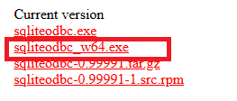
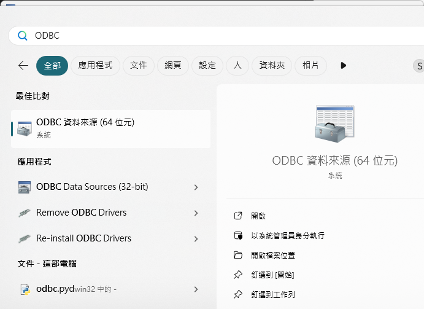
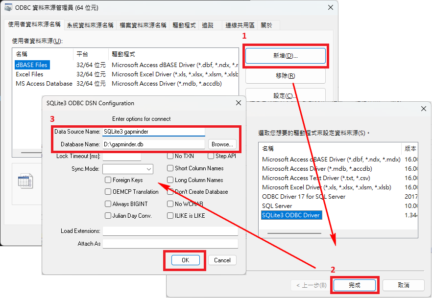
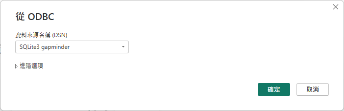
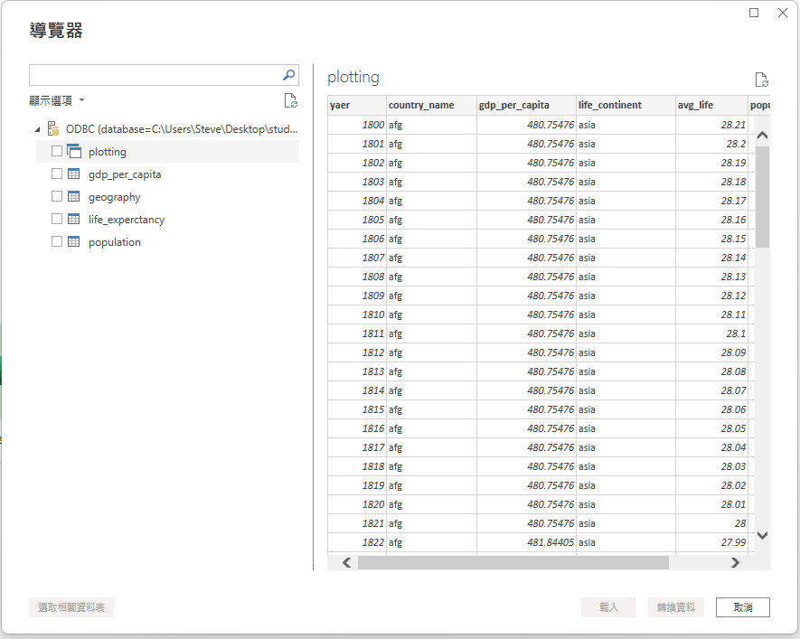
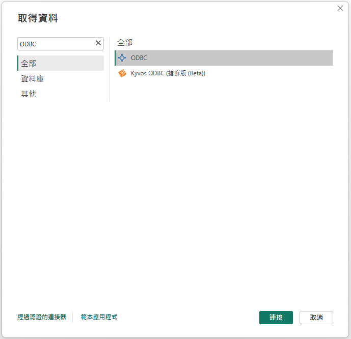
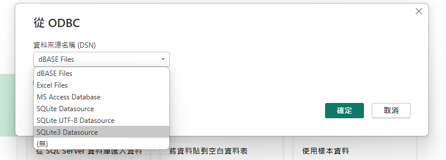
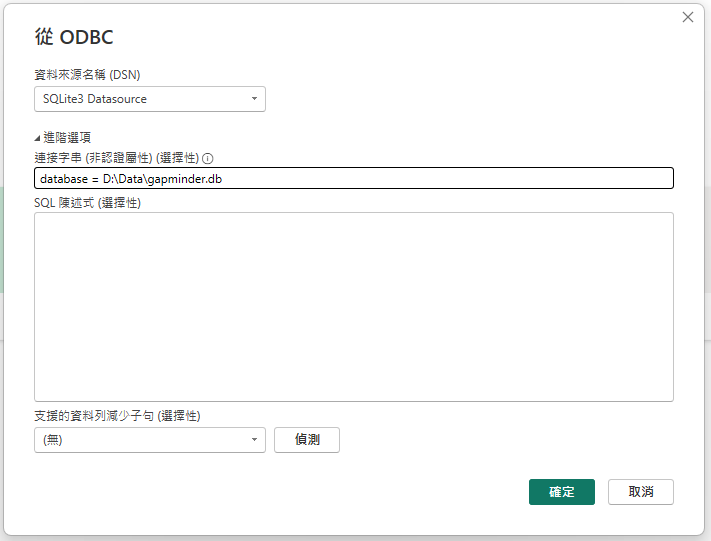

## PowerBi 連線 SQLite

### 注意事項
- 確認電腦是否有安裝 [SQLite ODBC driver for Win64](https://www.ch-werner.de/sqliteodbc/)

### 方法1
1. Windwos 搜尋 **"ODBC資料來源"**

2. 新增 **"ODBC 資料來源管理員"** SQLite 資料庫。
    - Data Source Name：設定資料名稱，可以自己設定。
    - Database Name：設定db檔案位置。

3. 設定 **"資料來源名稱(DSN)"**

4. 匯入 **"資料表"**

### 方法2
1. 找尋**ODBC**

2. 點選**SQLite3 Datasource**

3. **進階** -> 連接字串輸入**database=[檔案位置]**

4. 確定資料表狀態

